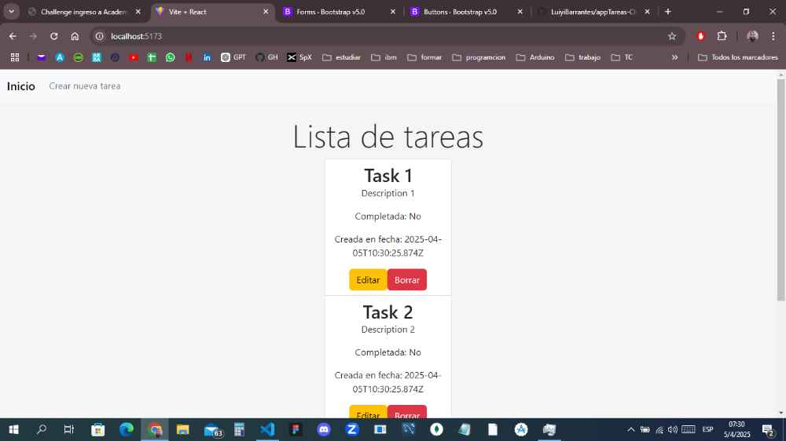
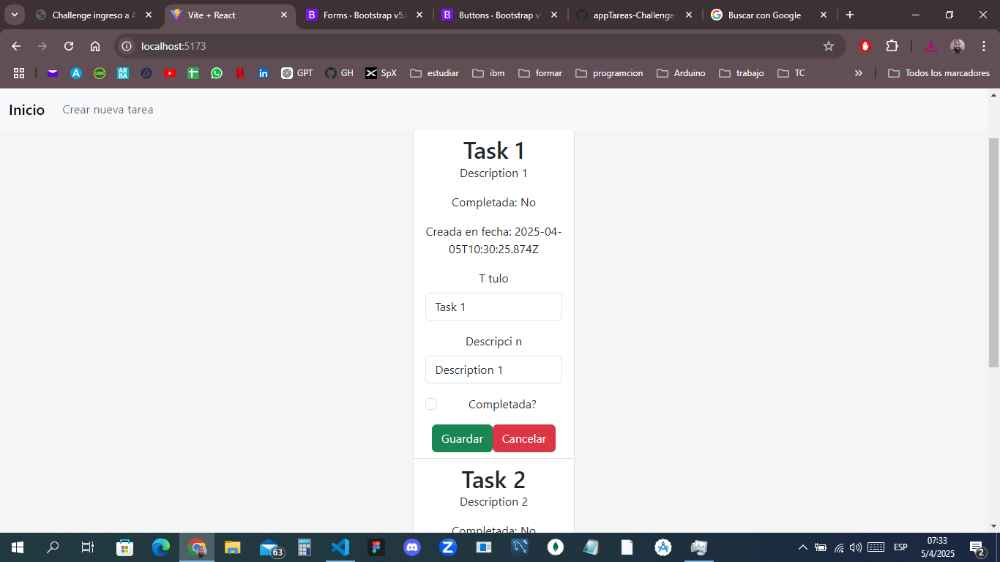
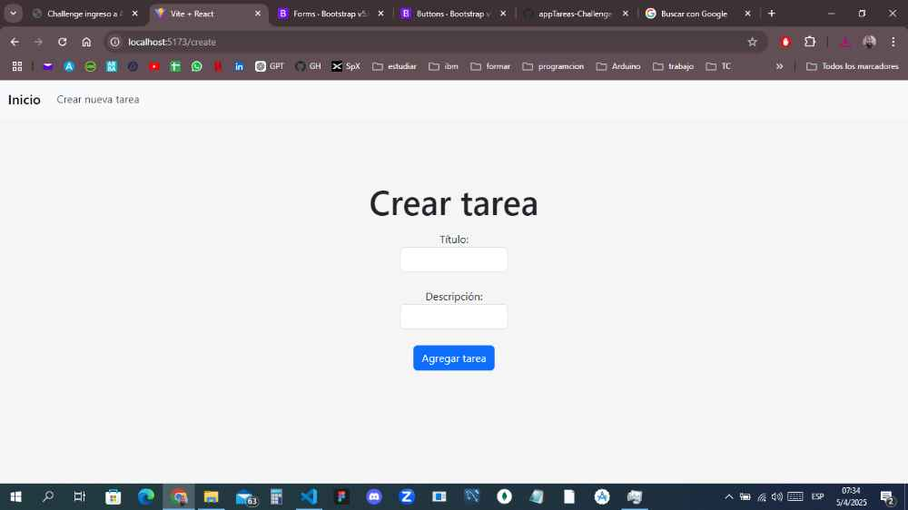
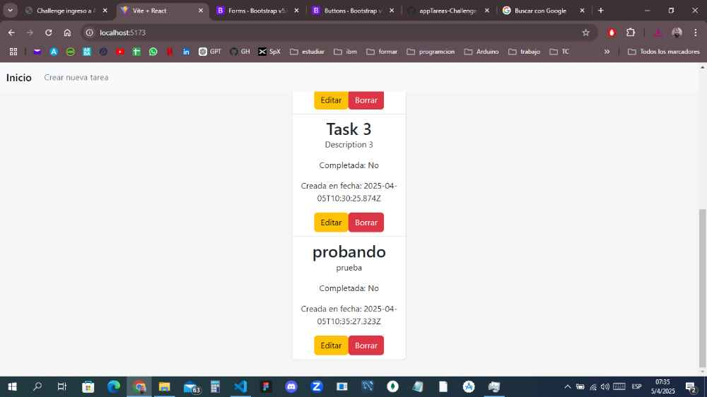
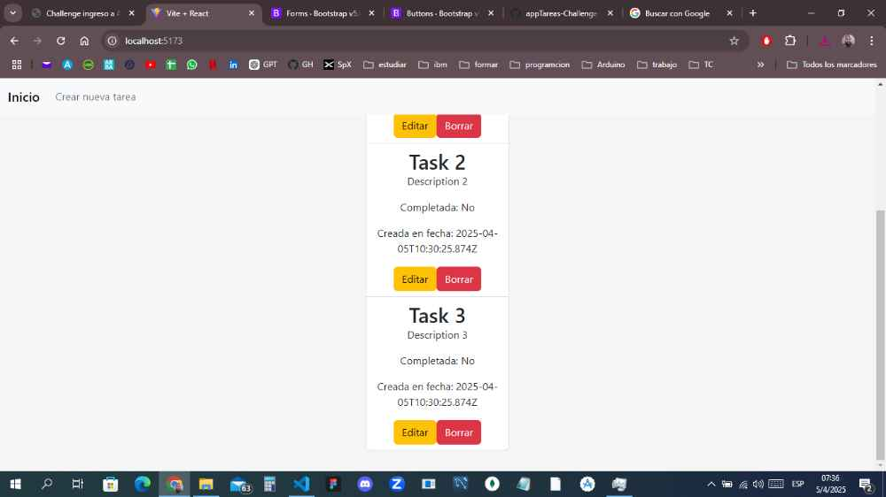

# 📝 App de Lista de Tareas - Challenge AcademiaForIT

Este proyecto es una aplicación fullstack sencilla construida con **React (Vite)** en el frontend y **Express** en el backend usando typescript de forma muy basica. Tiene la funcionaliad de un CRUD primitivo, siguiendo el concepto de mantener un array de las tareas en memoria.

---

## 📦 Tecnologías utilizadas

- Backend: Node.js + Express + TypeScript
- Frontend: React + Vite (JavaScript)
- Comunicación entre frontend y backend mediante `fetch`

---

## 🚀 Instrucciones para ejecutar de manera local

### 📁 1. Clonar el repositorio

```bash
git clone https://github.com/LuiyiBarrantes/appTareas-Challenge-AcForIT
cd appTareas-Challenge-AcForIT
```
---

### ⚙️ 2. Instalar dependencias

#### 🛠 Backend

```bash
cd backend
npm install
```

#### 💻 Frontend

```bash
cd ../frontend
npm install
```

---

### ▶️ 3. Ejecutar el proyecto

#### ✅ Iniciar el Backend

```bash
cd backend
npm run dev
```

> El backend correrá en: `http://localhost:3000`

#### ✅ Iniciar el Frontend

En otra terminal:

```bash
cd frontend
npm run dev
```

> El frontend correrá en: `http://localhost:5173`

---

## 📌 Notas

- El backend usa un **array en memoria** para guardar las tareas (no se persiste al reiniciar).
- Asegúrate de tener **Node.js versión 18 o superior**.
- Si necesitas cambiar los puertos, puedes hacerlo en el código del backend y frontend.

---

## 📁 Estructura de carpetas

```
/backend  
  └── src/      
      ├── controllers/
      |    └── task.contrllers.ts
      ├──data/
      |    └── tasks.ts 
      ├── models/
      |    └── tasks.models.ts
      ├── routes/
      |    └── tasks.routes.ts
      └── index.ts

/frontend
  └── src/
      ├── Asets/
      ├── components/
      |     ├── TaskForm.jsx
      |     ├── TaskItem.jsx
      |     └── TaskList.jsx
      ├── context/
      |     └── TaskContext.jsx
      └── pages/
           ├── Form.jsx
           └── Home.jsx
```

---
## 📸 Capturas de pantalla






---

## 🧑‍💻 Autor

Proyecto realizado por **Barrantes Luis Alfredo** para el challenge de **AcademiaForIT**.